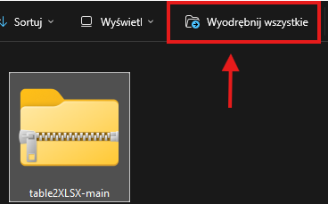
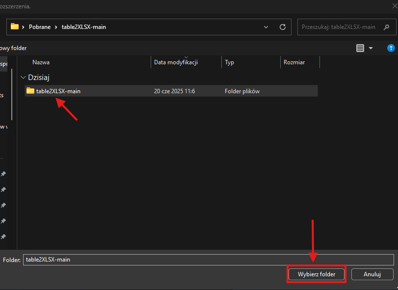
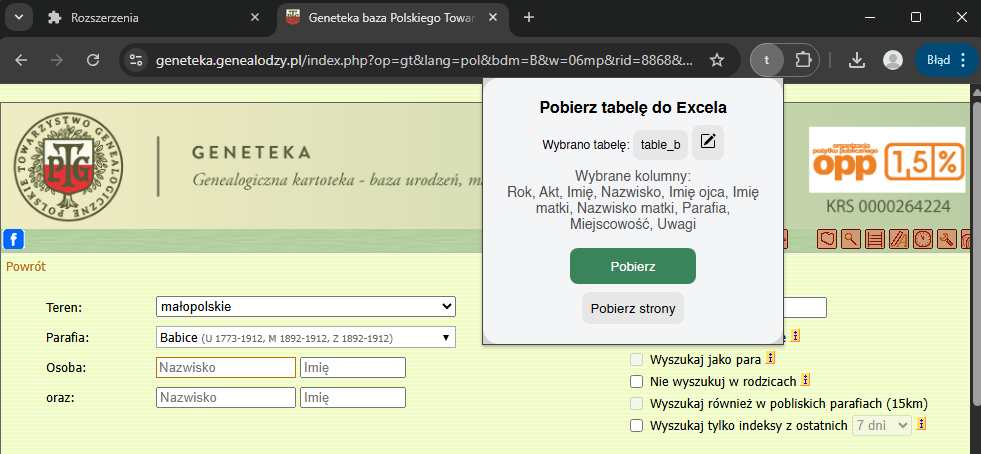

# Dane z tabel do pliku Excela

Dodatek do chroma, który pozwala na pobranie dane z tabel do pliku Excela (.xlsx). Został stworzony na potrzebę pobierania danych se strony [geneaolodzy.pl](https://geneszukacz.genealodzy.pl/).

# Jak zainstalować?

1. Pobierz ZIP'a z githuba. Możesz to zrobić wybierająć (Kod -> Pobierz ZIP) lub przez [link do pobierania](https://github.com/d0minik2/table2XLSX/archive/refs/heads/main.zip)\

2. Wyodrębnij (rozpakuj) folder. (Prawy przycisk myszy -> wyodrębnij wszystkie...)\

3. Wejdź na [rozszerzenia chrome](chrome://extensions/) i zaznacz tryb dewelopera. Następnie kliknij przycisk załaduj rozszerzenie. \

4. Wybierz rozpakowany folder/ \

5. Otwórz rozszerzenie (w prawym górnym rogu przeglądarki jest ikonka rozszerzenia) \

6. Rozszerzenie jest zainstalowane, możemy je przypiąć aby cały czas było w prawym górnym rogu przeglądarki.
Dodatek daje nam dwie opcje:
- Pobierz (pobiera aktualnie widoczną tabelę do pliku excela)
- Pobierz strony (pobiera wszystkie strony tabel widoczne na stronie do jednego pliku. Zajmuje to chwilę czasu i nie należy w tym czasie wyłączać okna rozszerzenia)

